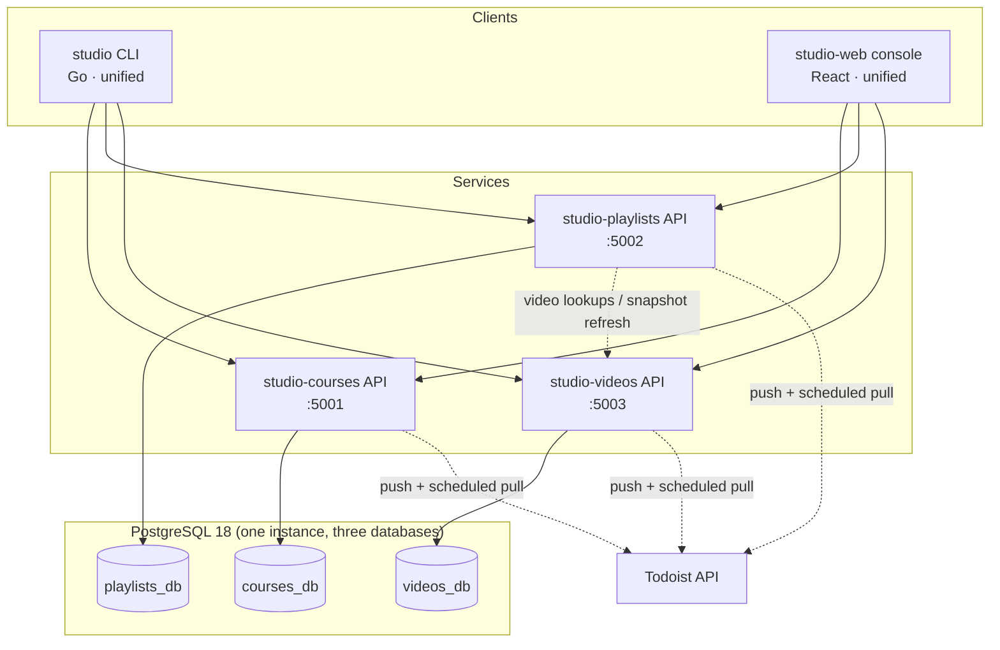

# Target Architecture

## System overview

Principles:

* **Apps are vertical and independent**: own schema, own migrations, own deploy. No shared
  database, no cross-DB foreign keys, no synchronous dependency between apps — with one
  deliberate exception: studio-playlists calls the studio-videos *read* API to resolve and
  refresh video references, and degrades gracefully (cached snapshots, placeholder items)
  when it's unreachable.
* **Clients are horizontal**: the CLI and web console span all domains but depend only on
  published API contracts (OpenAPI), never on app internals.
* **Shared code is a library, not a service**: `studio_core` (Python) and `@studio/ui-core`
  (TypeScript) from `studio-shared`, versioned by git tags.

## Data ownership

| Fact | System of record | Others hold |
|---|---|---|
| Course / chapter / lesson structure, lesson production state | studio-courses | — |
| Standalone video identity, production state, YouTube IDs, paths | studio-videos | playlists: `video_ref_id` + cached snapshot |
| Playlist membership and ordering | studio-playlists | — |
| Todos, audit events, settings | each app, for its own content | — |
| Todoist connections/mappings | each app, for its own content | — |
| Organizations | each app (by slug convention) | — |
| Status / asset vocabulary | `studio_core.enums` (code, not data) | all apps validate against it |

## API conventions (all three apps)

* REST + JSON, Flask + flask-restx (Swagger UI served at `/`), one OpenAPI spec per app
  committed to the repo (`openapi.json`, regenerated in CI).
* **Org scoping is mandatory on every route**: `X-Organization` header preferred,
  `?organization=` fallback. Missing scope resolves to `default`.
* Optional actor identity via `X-Actor` (feeds audit, as today).
* Every mutation writes an audit event (library-enforced via `studio_core.audit`).
* Common endpoints from `studio_core`: `/healthz`, `/metrics` (Prometheus),
  `/todos/*`, `/audit/*`, `/settings/*`, `/integrations/todoist/*`.
* Tree import/export endpoints per app (`POST /…/import`, `GET /…/{id}/export`) so the
  CLI does hierarchy work server-side instead of stitching CRUD calls.
* Errors: `{"message": str, "errors": {...}}`, conventional HTTP codes.
* IDs are integers per app DB. Cross-app references always carry the app name in the field
  name (`video_ref_id`) — never bare `id` — so provenance is unambiguous.

## Schemas

Each app's full DDL is in its `TECH-SPEC.md`. Shared shape:

* Typed tables per entity with **real FKs enforcing hierarchy** (`lessons.chapter_id` →
  `chapters.course_id` → `courses`), replacing the old self-referencing
  `content_items.parent_id`.
* Postgres enums for statuses and asset types/states (mirroring `studio_core.enums`).
* `organizations` table per app; all content rows carry `organization_id`.
* Relative paths only (`relative_path` columns); the CLI owns root-path resolution,
  unchanged from today.
* **Alembic from day one** in every app; `init.sql` is replaced by migration history.

## Local development

| Service | API port | Dev DB port |
|---|---|---|
| studio-courses | 5001 | 5433 |
| studio-playlists | 5002 | 5434 |
| studio-videos | 5003 | 5435 |
| studio-web | 5173 (Vite) | — |

Each app repo has its own `docker-compose.yaml` (app + its own Postgres + a `test` profile
with isolated db, mirroring the current monorepo's container-first validation pattern).
`studio-deploy` provides an umbrella compose that runs the whole stack for end-to-end work.

## Deployment (homelab k3s)

* Namespace `studio` (prod) / `studio-test` (test), kustomize base + overlays per app
  living in each app repo; `studio-deploy` composes them and owns the shared concerns:
  one Postgres instance with three databases, ingress, secrets layout.
* Same patterns as the current `infrastructure/` folder (probes against `/healthz`,
  `.secrets.env` per overlay), carried forward.
* Todoist: per-app env tokens (`TODOIST_TEST_API_TOKEN` / `TODOIST_PROD_API_TOKEN`,
  `TODOIST_SYNC_ENV`), local-first push + scheduled-pull reconciliation exactly as the
  current spec defines — no inbound webhook requirement in v1.

## Tenancy

`organization` remains the tenant boundary in every app, as a first-class table
(key/slug, display name, default settings JSON) instead of a bare varchar. Org keys are
kept identical across apps by convention; the CLI and web console set the scope once and
pass it everywhere.
